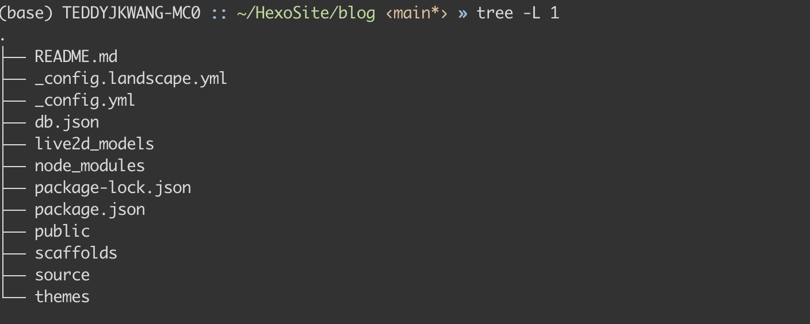

大家好，我是王泰迪，是一名来自腾讯的推荐算法工程师。早在两年前我就买断了这个域名，但由于懒，一直没怎么写文章。随着人生阶段的不断深入，我越来越认同把一些想法内化沉淀的重要性，写文章就是一个很好的手段。于是在2021年年末重启了我这件事情，希望能坚持下来，给一路走来的自己做一个成长记录。

第一篇文章，就先简单写下您当前看到的个人博客的部署工具hexo，一起来学习下它的安装和部署方式

## 安装hexo

hexo安装请参考 https://hexo.io/zh-cn/ ，

### 个性化配置 hexo

参考 https://blog.csdn.net/as480133937/article/details/100138838 


### 引用图片

参考 https://yanyinhong.github.io/2017/05/02/How-to-insert-image-in-hexo-post/


### hexo在不同电脑上的迁移

我采用的方法是，将整体打包上传git，项目目录结构如下图，



并在新电脑上，进入项目并执行

```shell
npm install 
```

该命令会检测 ./package.json文件夹下依赖项，使得两边依赖对齐。


评论系统使用livere https://livere.com/my_Livere

