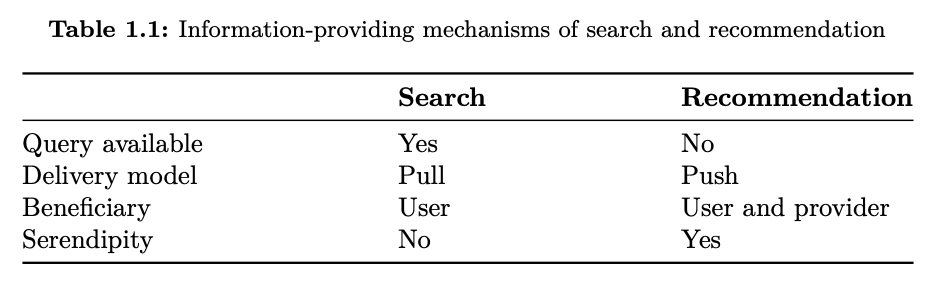
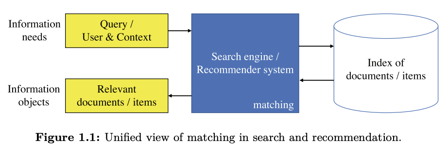
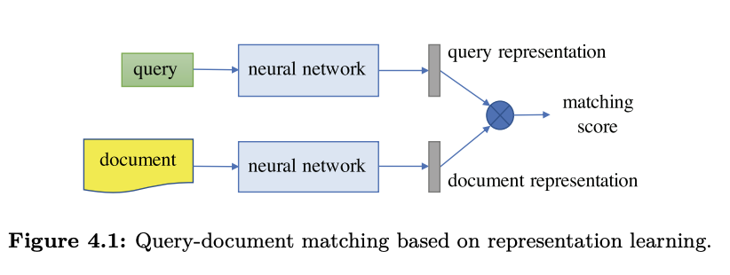

李航、何向南老师的这篇文章《[Deep learning for matching in search and Recommendation](https://gsai.ruc.edu.cn/uploads/20210701/74fa9572b1a1b5131271df0021435052.pdf)》是召回（matching）领域的一篇非常好的综述。有兴趣的同学可以下载下来好好读一读。本文借着这篇文章的梳理思路（对英文原文的翻译和理解），来展开学习一下推荐系统中召回领域的发展脉络。

<!-- more -->

# 摘要

召回（matching）是指一个query对于一篇文档document的相关性（搜索领域定义），或是一个用户对于一个物品的感兴趣程度（推荐领域定义）。在搜索和推荐领域，召回都是一个关键和重要的问题。基于机器学习技术，我们可以根据输入特征表示和有标签的数据，来学习一个召回函数（matching function），这种方式被称为"learning to match"。近年来，使用深度学习技术在搜推领域的工作越来越多。背靠着海量数据和强大算力、以及逐步壮大的深度学习新技术，使用深度学习技术做召回已经成为了搜推领域的SOTA，这其中的关键是深度学习技术对于query、document、user、item、context等类的特征强大的表达和泛化能力。

本综述首先以一个统一的视角，全面系统的总结了搜推领域的深度召回模型，让我们可以在统一的架构下审视两个不同场景中的问题；其次，本综述将深度召回模型方案分成两类：表示学习（representation learning）和召回函数学习（matching function learning）。

最后，召回问题不限于搜推领域。相关问题也会出现在paraphrasing、QA、图像标注等。综述中介绍的方法能泛化成两个空间物体中的匹配问题。

每章的内容概况：

第一章：对搜索领域和推荐领域的基本情况进行介绍，对比两个领域的异同，说明两个领域分别的难点。并说明此篇综述不同于以往文章的原因

第二章：对传统机器学习的介绍

第三章：对深度学习介绍

第四章：搜索领域中的深度召回模型介绍

第五章：推荐领域中的深度召回模型介绍（本文重点剖析）

第六章：总结与展望

# Chapter 1 介绍

## ~~1.1~~ 搜索和推荐

搜索和推荐是当今两种信息获取的范式，被应用在许多场景中。比如抖音、微博，都有着自己推荐和搜索的场景，用户也经常使用这两种方式来获取信息。对互联网从业者来说，这里面至关重要的一个问题就是，在正确的时间、地点、上下文场景中，在巨大的内容池中，提供给用户他们感兴趣且相关的、需要的内容。

下面两幅图比较好的说明了搜索和推荐的区别

搜索：

```
有query：搜索框中输入的关键词（列表）
搜索中最基本的机制是pull，即从用户侧获取明确的query需求
用户的需求得到满足，Beneficiary（受益人）是用户
随机性（Serendipity）相对比较小，搜索系统返回的结果必须比较相关
```

推荐：

```
没有query的概念，推荐系统需要理解用户画像、历史行为等，将信息推荐给用户
最基本的操作机制就是push，给用户推荐一些他们并没有明确指定的信息
受益人是用户（获得感兴趣的信息）和平台（获得流量收益）
推荐系统是允许提供给用户一些意料之外的信息的（但要有用）
```






# Chapter 5 推荐领域的深度召回模型

> 深度学习用于推荐召回，主要可以分为两类：
>
> - 表示学习（Methods of representation learning）
>
>   深度网络用来编码用户和物品的向量表示，并让他们进行比较，得出一个最终的匹配分数
>
> - 召回函数学习 (Methods of matching function learning)
>
>   深度学习用来做用户、物品、（上下文）等信息的交叉，来产生召回信号，并把它们相加，得到最终的匹配分数

## 5.1 基于表示学习的召回模型

下图是搜索系统的表示学习的召回模型，作为类比，query等价于推荐系统中的user，document等价于推荐系统中的item。原始输入的user和item分别在不同的表示空间，分别经过一个神经网络结构之后，分别映射到相同空间下的 user representation和item representation。定义user特征为u，item特征为i，基于表示学习的召回模型的表达式可以定义为：
$$
f(u,i)=F(\phi_u(u),\phi_i(i))
$$
其中 $$F$$是相同空间下的相似度量函数，比如内积、或者cosine函数。针对user和item输入数据，主要分为四种输入数据和其对应的处理方式：

1.unordered interactions（user在系统中对item的无序交互特征，比如深度MF、auto-encoder类模型）

2.序列特征（处理序列特征，比如RNN类或CNN类模型）

3.多模态特征（user/item 属性、文本、图像）

4.linked graph（user-item graph 或 知识图谱）





